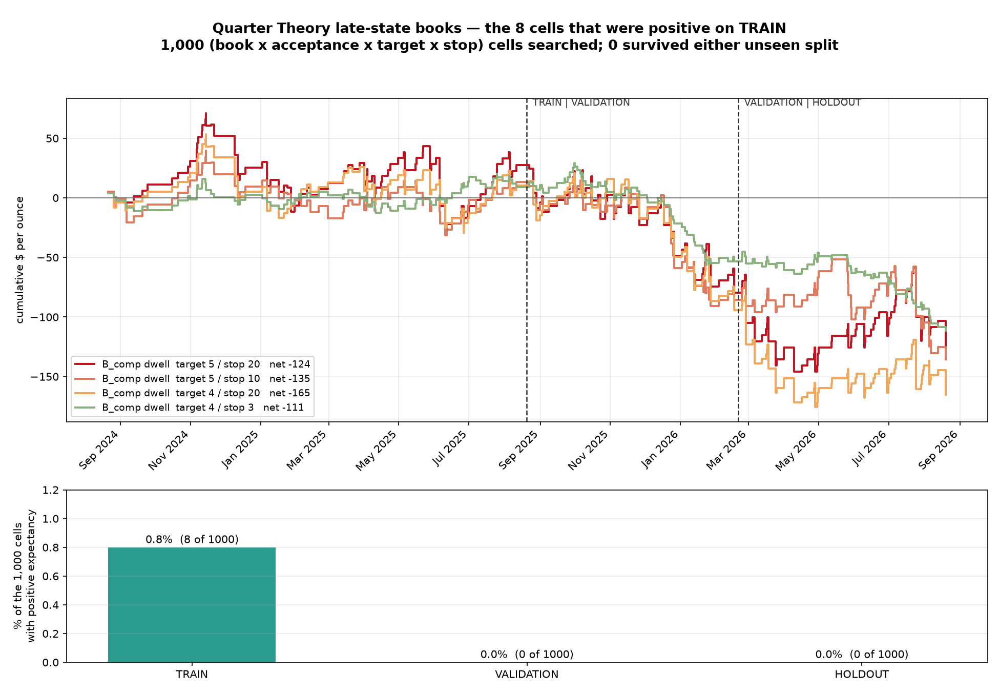

# Quarter Theory late-state books — Round 1

Brief: find whether any specific Quarter Theory state transition provides real
exploitable edge in gold, with the frequency constraint lifted and tiny targets
explicitly allowed. Books A (Whole → Completion) and B (Completion → next LQP)
first, MFE/MAE before stops, chronological TRAIN/VALIDATION/HOLDOUT.

Code `research/qt2/code/`. Reproduce:
```
python3 research/qt2/code/inventory.py        # data + continuity
python3 research/qt2/code/build_sweep.py      # events + 1,000-cell race
python3 research/qt2/code/zerocost.py         # mid-fill control
python3 research/qt2/code/chart.py
```

---

## Verdict: **B — no tradable expectancy in the tested implementations**

Not "we could not find a fit". A fit exists on TRAIN; it does not survive either
unseen split, and the mechanism that kills it is measured rather than inferred.

| | TRAIN | VALIDATION | HOLDOUT |
|---|---|---|---|
| window | 2024-08-20 → 2025-08-20 | 2025-08-20 → 2026-02-20 | 2026-02-20 → 2026-08-21 |
| cells with positive expectancy | **8 of 1,000** (0.8%) | **0 of 1,000** | **0 of 1,000** |
| best expectancy in the split | +$0.293 / trade | **−$0.554** | **−$0.546** |

**Cells positive in all three splits: 0 of 1,000.** The eight TRAIN survivors,
pooled on unseen data: n = 1,112, **PF 0.700, −$0.966/trade, −$1,074**.



---

## 1. Data (brief §1, §9)

155,723,004 ticks in two contiguous parts, no synthetic bars anywhere.

| | 2024-25 | 2025-26 |
|---|---|---|
| ticks | 64,093,055 | 91,629,949 |
| NY span | 2024-08-20 10:00 → 2025-08-20 09:59 | 2025-08-20 10:00 → 2026-08-20 09:59 |
| monotonic / duplicate ms | YES / 0 | YES / 0 |
| bid > ask, zero spread | 0, 0 | 0, 0 |
| median spread | **$0.510** | **$0.670** |
| price range | $2,470.76 – $3,500.32 | $3,321.30 – $5,599.60 |

Gaps are attributed, not filled: 52/51 weekend closes, 201/199 daily 17:00–18:00
settlement breaks, and 98/45 unattributed of which 8–10 are holiday closures
(the 73-hour ones are Good Friday). Median unattributed gap is 1.5–2.4 minutes —
thin liquidity, not a data defect.

---

## 2. The state machine (brief §3, §7)

Attempts are found on the coarse $25 grid; everything else is computed on **raw
ticks inside each attempt window**, which average ~1,100 ticks. Nothing is
quantised, which matters when the targets under test start at $0.50.

106,451 attempts across both years. Rungs at 0 / 2.50 / 7.50 / 12.50 / 20.00 /
22.50 / 25.00 from the originating LQP, mirrored for bearish.

---

## 3. Acceptance vs touch — the one mechanism that could have broken the geometry

This is the brief's §8 and the reason this round was worth running. Six entry
definitions were located at each rung, so the *same* event is traded six ways on
identical ticks:

| definition | rule |
|---|---|
| TOUCH | first tick at or beyond the rung |
| EXC | first tick $0.50 beyond it |
| TICKS | first tick after 50 consecutive ticks beyond it |
| RETEST | beyond → back inside → beyond the prior high, LQP intact |
| DWELL | first tick after 60 continuous seconds beyond it |

Each definition enters at a **different price**, so each has its **own**
geometric baseline `p_geom = to_lqp / (to_lqp + to_next)` — the probability a
driftless walk reaches the next rung before losing the LQP from that exact fill.
Comparing raw win rates across definitions would be meaningless; comparing each
against its own baseline is the whole test.

**Both years pooled, real bid/ask fills:**

| book | definition | n | to_next | P(next rung) | p_geom | **EDGE** | z |
|---|---|---|---|---|---|---|---|
| A Whole→Comp | touch | 1,823 | $1.92 | 84.1% | 92.3% | **−8.2%** | −13.1 |
| A Whole→Comp | exc | 1,777 | $1.44 | 86.3% | 94.2% | **−7.9%** | −14.2 |
| A Whole→Comp | ticks | 1,435 | $1.25 | 88.6% | 94.8% | **−6.2%** | −10.6 |
| A Whole→Comp | retest | 1,238 | $1.07 | 89.5% | 95.3% | **−5.8%** | −9.7 |
| A Whole→Comp | dwell | 655 | $0.98 | **90.8%** | 95.6% | **−4.8%** | −6.0 |
| B Comp→LQP | touch | 1,606 | $1.90 | 86.8% | 93.1% | **−6.3%** | −9.9 |
| B Comp→LQP | dwell | 233 | $1.25 | 88.8% | 95.2% | **−6.3%** | −4.5 |

**Acceptance does exactly what the theory promises, and it is worth nothing.**
Requiring 60 seconds of persistence lifts the raw hit rate from 84.1% to 90.8% —
a genuine, large improvement. It also lifts the geometric baseline from 92.3% to
95.6%, because waiting means entering closer to the target. The win rate is
bought at precisely the price of its own improvement. Every definition, in both
books, in both years, scores **below** its own baseline.

Unresolved trades cannot explain it: TIME exits are 0.6–3.4%.

---

## 4. MFE / MAE, and why they cannot pick the stop (brief §7)

TRAIN, Book A, TOUCH: median MAE **−$12.93**, p90 −$39.39, median MFE $11.60.
A $0.50 stop is touched by 100% of events and a $5.00 stop by 84.2%.

Those numbers are **order-blind** — they count adverse moves that happen after
the target would already have paid, the same defect caught in the Micro-Q3 Pine
audit. So stops were not read off that distribution. Instead all
10 targets × 10 stops were **raced** on the real quote path, which is the only
construction that answers "which came first". 1,215,900 race outcomes.

---

## 5. Tiny targets against real spread (brief §13)

TRAIN, Book A, TOUCH, structural $20 stop:

| target | win rate | PF | expectancy | spread as % of target |
|---|---|---|---|---|
| **$0.50** | **89.3%** | **0.23** | **−$1.500** | **113%** |
| $0.75 | 88.0% | 0.32 | −$1.403 | 75% |
| $1.00 | 87.2% | 0.39 | −$1.351 | 56% |
| $1.50 | 85.9% | 0.53 | −$1.145 | 38% |
| $2.50 | 81.2% | 0.66 | −$1.036 | 23% |
| $3.00 | 79.1% | 0.71 | −$0.949 | 19% |
| $5.00 | 69.7% | 0.71 | −$1.381 | 11% |

The answer to "are tiny targets acceptable if expectancy survives cost" is that
**it does not survive at any target size**, and the smallest are the worst. Note
the top row: a **$0.50 target hits 89.3% of the time** — within a rounding error
of the 89.66% the whole architecture was built on — and it is the single worst
cell in the table. That win rate is real. It costs $1.50 a trade to collect.

---

## 6. The zero-cost control — is it cost, or are the rules wrong?

Identical events, mid entry, mid exit path, no spread, no slippage:

| book | definition | EDGE (real fills) | **EDGE (zero cost)** |
|---|---|---|---|
| A Whole→Comp | touch | −8.2% | **−3.2%** |
| A Whole→Comp | dwell | −4.8% | **−1.2%** |
| B Comp→LQP | touch | −6.3% | **−1.2%** |
| B Comp→LQP | retest | −5.8% | **−0.8%** |

Roughly two-thirds of the deficit is execution; the residual −1% to −3% is the
crossing-overshoot artefact already registered as H106. So the rules are not
anti-predictive — **they are a coin flip, and the spread does the rest.**

The zero-cost target sweep says the same: Book A / TOUCH at a $0.50 target
returns PF **0.459** with a 94.8% win rate *even paying nothing*. Risking $20 to
make $0.50 does not work in a frictionless market either.

---

## 7. Filter waterfall (brief §11)

Every step shown before and after, TRAIN, Book A:

Target held at $2.50 and stop at $20.00 so only the entry rule changes:

| step | n | win rate | PF | expectancy | net |
|---|---|---|---|---|---|
| all Whole touches | 234 | 81.2% | 0.66 | −$1.036 | −$242.4 |
| + require $0.50 excursion | 228 | 80.7% | 0.64 | −$1.146 | −$261.2 |
| + require 50 ticks beyond | 217 | 81.6% | 0.73 | −$0.753 | −$163.4 |
| + require retest-and-hold | 177 | **85.3%** | **0.90** | **−$0.237** | −$41.9 |
| + require 60s dwell | 176 | 81.2% | 0.75 | −$0.690 | −$121.5 |

**This is not monotone, and that matters.** Strictness rises down the table but
PF goes 0.66 → 0.64 → 0.73 → 0.90 → 0.75. Retest-and-hold is the best cell and
60-second dwell — a *stricter* requirement on a nearly identical event count
(176 vs 177) — is materially worse. A filter capturing something real would not
reverse when tightened. Nothing reaches 1.0 at any step.

Note this table and §3 measure different things and are not in conflict. §3
races each definition to the **next rung**, whose distance shrinks as the entry
moves later, so its baseline moves with it. Here the target is **pinned at
$2.50** for every row, so the geometry is held constant and only the entry rule
varies. The §3 ordering is monotone because the geometry is doing the ordering;
this one is not monotone because, with the geometry held still, there is nothing
left to order.

---

## 8. What was frozen and what happened

Best of 1,000 TRAIN cells: **Book B / dwell(60s) / target $5.00 / stop $20.00**,
PF 1.08, 76.6% win rate, +$0.293/trade on n = 94. Frozen, then run forward:

| split | n | win rate | PF | expectancy | net |
|---|---|---|---|---|---|
| TRAIN | 94 | 76.6% | 1.08 | +$0.293 | +$27.5 |
| VALIDATION | 70 | 71.4% | **0.70** | **−$1.529** | −$107.0 |
| HOLDOUT | 69 | 78.3% | **0.86** | **−$0.642** | −$44.3 |

All eight TRAIN-positive cells reverse sign out of sample without exception.

---

## 9. What this round establishes, and what it does not

**Established, on gold, on 155.7M ticks:**
- Acceptance is a real phenomenon that raises hit rates and carries no edge,
  because it raises the geometric baseline by at least as much.
- No target between $0.50 and $5.00, against any stop between $1 and $20,
  produces positive expectancy in either unseen split.
- The deficit is roughly two-thirds execution cost and one-third crossing
  overshoot. The rules are a coin flip, not an inverted signal.

**Not established:**
- Books C ($100 transition) and D (failed-quarter reversal) were run in the
  previous round under the touch definition and lost (`research/yotov_engine/`);
  they have **not** been re-run under the acceptance definitions. Given §3 they
  are unlikely to differ, but that is a prediction, not a measurement.
- Trend-wave classification (brief §5) is not implemented. It should be judged
  after an entry with non-zero zero-cost edge exists, not before.
- The FX claim. All of this is gold.

**The constructive read.** Two rounds now agree that the binding constraint is
not the entry rule — it is that gold's ~$1.50 round-trip cost is a fixed toll on
a signal worth about zero. Nothing inside the $25 quarter ladder pays that toll.
Any next hypothesis worth the compute has to clear one bar first: **a zero-cost
edge over its own geometric baseline that is positive and material.** That single
number, cheap to compute, would have ended both rounds in an hour.
